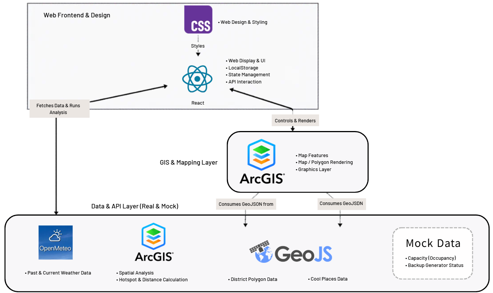

# Climate Response Hub

**Climate Response Hub** is a decision-support dashboard that helps emergency coordinators identify vulnerable neighbourhoods during heatwaves and outage-related climate events.

The project combines map data, weather risk, cooling centre locations, vulnerability indicators, and simulated infrastructure data into one dashboard so coordinators can make faster and more informed response decisions.

> Our goal is not to replace emergency coordinators.  
> Our goal is to help them see risk faster, prioritize support more clearly, and coordinate response actions more effectively.

**Video Link:** [Watch our 5-minute Pitch Video](https://www.youtube.com/watch?v=rfzgxAIvG8Q)

**Live Demo:** [Climate Response Hub App (Vercel)](https://energy-hackathon-2026-beta.vercel.app/)

---

## Project Vision

Climate-related emergencies are becoming more frequent, but their impact is not equal across communities.

During a heatwave or power outage, some neighbourhoods may face higher risk because of:

- higher elderly population
- fewer nearby cooling centres
- limited backup power access
- higher energy burden
- weaker access to emergency support
- fragmented or hard-to-access information

Emergency coordinators often need to look across multiple sources to understand risk, available resources, and response status. This can slow down decision-making when time matters.

**Climate Response Hub** brings these signals together into a single operational view.

---

## Problem Statement

How might we help emergency coordinators identify vulnerable neighbourhoods and prioritize response actions during heatwaves and outage-related climate events?

---

## Why This Problem Matters

A heatwave or outage is not only an infrastructure issue. It is also a community resilience and equity issue.

The same climate event can affect neighbourhoods differently depending on age demographics, access to cooling spaces, backup power availability, and local resource capacity.

By helping coordinators identify which neighbourhoods need support first, Climate Response Hub supports faster planning, better coordination, and more targeted use of limited emergency resources.

---

## Target Users and Stakeholders

### Primary User

**Emergency Management Coordinators**

They use the dashboard to monitor risk, identify priority neighbourhoods, and log response actions during climate-related emergency events.

### Secondary Stakeholders

- **City of Toronto / Municipal Government**  
  Supports emergency planning and resource allocation.

- **Public Health Officials**  
  Helps protect vulnerable populations during extreme heat or outage-related events.

- **Community Centres, Libraries, and Shelters**  
  Serve as cooling and support locations.

- **Energy Companies and Sponsors**  
  Can use the insights to support backup power, resilience planning, and targeted infrastructure investment.

- **Vulnerable Residents**  
  Benefit from faster and better coordinated emergency support.

---

## Solution Overview

Climate Response Hub provides an interactive dashboard where coordinators can:

- view Toronto neighbourhoods on a map
- identify high-risk neighbourhoods
- check nearby cooling centres and support resources
- review vulnerability indicators
- review simulated capacity and backup power information
- log planned response actions
- update or clear response records after an event

The dashboard acts as a planning and coordination layer. It does not directly send emergency services or control infrastructure.

---

## Core Use Cases

For the MVP and demo, we focus on two main use cases.

---

## Use Case 1: Identify a High-Risk Neighbourhood

### User Story

As an emergency management coordinator, I want to view neighbourhood-level climate and outage vulnerability on a map so that I can identify which area needs support first.

### Demo Flow

1. The coordinator opens the Climate Response Hub dashboard.
2. The map displays Toronto neighbourhoods.
3. A risk layer highlights neighbourhoods with higher vulnerability.
4. The coordinator selects a high-risk neighbourhood.
5. The dashboard displays key information such as:
   - risk level
   - elderly population or vulnerability indicators
   - nearby cooling centres
   - resource availability
   - backup power or capacity information
6. The coordinator identifies the neighbourhood as a priority area.

---

## Use Case 2: Log a Response Action

### User Story

As an emergency management coordinator, I want to log a planned response action for a vulnerable neighbourhood so that other coordinators can see which areas already have a response plan on file.

### Demo Flow

1. The coordinator selects a high-risk neighbourhood.
2. The dashboard shows possible or recommended response actions.
3. The coordinator creates an action log, such as:
   - request mobile cooling support
   - extend cooling centre hours
   - check backup power availability
   - mark the neighbourhood as monitored
4. The action appears in the dashboard.
5. The coordinator can update or clear the action status.

### Important Clarification

Climate Response Hub does not physically send emergency resources.

It helps coordinators plan, log, and track response actions. Real-world action happens outside the system.

---

## MVP Features

The current MVP includes:

- interactive Toronto neighbourhood map
- neighbourhood-level risk visualization
- cooling centre / support resource display
- selected neighbourhood detail panel
- weather-informed risk context
- rule-based triage logic
- simulated capacity and backup power data
- prototype response action logging
- supporting documentation and diagrams

---

## Data Sources

| Data | Source | Type |
|---|---|---|
| Toronto neighbourhood boundaries | GeoJSON / Toronto geographic data | Real |
| Cooling centres / cool spaces | Toronto Open Data | Real |
| Weather / heat risk data | Weather data / external source | Real or historical |
| Elderly population / vulnerability indicators | Neighbourhood-level data or simulated data | Real or mock depending on availability |
| Backup generator availability | Mock dataset | Mock |
| Shelter or cooling centre capacity | Mock dataset | Mock |
| Response action logs | Local prototype data | Mock / local |

---

## Mock and Hard-Coded Data

Some data is mocked or hard-coded for the MVP because it is not publicly available in real time.

Mocked data includes:

- backup generator availability
- shelter or cooling centre capacity values
- some vulnerability indicators
- response action records
- action status
- some risk score values

This is intentional for the hackathon MVP.

In a production version, these values could be connected to municipal databases, emergency management systems, shelter management tools, utility partner APIs, or verified operational data sources.

---

## Data Structure and ETL

### Extract

The project collects geographic, facility, weather, and vulnerability-related data from open data sources and mock datasets.

### Transform

The data is cleaned, normalized, and connected using shared identifiers such as:

- `locationId`
- `AREA_SHORT_CODE`
- neighbourhood names or codes

The system then applies rule-based triage logic to estimate risk and highlight neighbourhoods that may need attention first.

### Load

The processed data is loaded into the React dashboard and displayed through ArcGIS/Esri map layers, UI panels, and action log components.

---

## Example Data Shape

### Neighbourhood Risk Data

```json
{
  "areaCode": "N001",
  "name": "Example Neighbourhood",
  "elderlyPercent": 18.5,
  "energyBurdenScore": 72,
  "heatRisk": "High",
  "nearbyCoolingCentres": 2,
  "backupPowerAvailable": false,
  "priorityLevel": "Critical"
}
```

### Cooling Centre Data

```json
{
  "locationId": "C102",
  "name": "Community Centre A",
  "address": "123 Example Street",
  "capacity": 80,
  "backupPower": true,
  "status": "Open"
}
```

### Response Action Log

```json
{
  "actionId": "A001",
  "areaCode": "N001",
  "actionType": "Request mobile cooling support",
  "status": "Planned",
  "notes": "High elderly population and limited nearby cooling centres"
}
```

---

## Architecture and Tech Stack

Climate Response Hub uses a frontend-focused MVP architecture.

The dashboard combines open data, GeoJSON layers, weather data, and mock infrastructure data. A rule-based triage layer helps identify neighbourhoods that may require attention first.

| Layer | Technology |
|---|---|
| Frontend | React |
| Map / GIS | ArcGIS / Esri |
| Data Format | GeoJSON, JSON |
| Data Sources | Toronto Open Data, weather data, mock datasets |
| Prototype Storage | localStorage / mock JSON |
| Documentation | README, UML diagrams, architecture diagrams |
| Version Control | GitHub |

### Architecture Flow

```text
Toronto Open Data + Weather Data + Mock JSON
                ↓
        Data Cleaning / ETL
                ↓
     Risk Scoring / Triage Logic
                ↓
       React Dashboard Frontend
                ↓
      ArcGIS / Esri Interactive Map
                ↓
Neighbourhood Details + Cooling Resources + Action Log
```

---

## Business Case

Climate Response Hub is designed to be practical for cities, emergency teams, and energy partners.

The value of the tool is not only showing data, but turning fragmented data into a clearer response decision.

### Economic Feasibility

The MVP is economically feasible because it uses:

- open data
- common web technologies
- lightweight mock datasets
- existing map infrastructure

Potential value includes:

- reducing inefficient resource allocation
- helping prioritize high-risk communities
- supporting sponsor investment decisions
- improving emergency planning without requiring a full new system immediately

### Technical Feasibility

The solution is technically feasible because it uses:

- React for the dashboard
- ArcGIS/Esri for geographic visualization
- GeoJSON and JSON data
- Toronto Open Data
- weather data
- local/mock storage for action logging

The MVP does not require a complex backend. Future versions could connect to municipal databases, shelter management systems, emergency management platforms, or utility partner APIs.

### Operational Feasibility

The dashboard fits into emergency planning workflows because coordinators already rely on maps, reports, and status updates.

Climate Response Hub does not remove the human decision-maker. It supports the coordinator by making risk, resources, and response status easier to understand in one place.

### Time Feasibility

The MVP is realistic within the hackathon timeline because it focuses on two core workflows:

1. identifying a high-risk neighbourhood
2. logging and updating a response action

This keeps the demo focused and avoids overbuilding.

---

## Sponsor and Implementation Value

Climate Response Hub can help sponsors and energy partners understand where support may create the greatest community impact.

Potential implementation opportunities include:

- identifying priority locations for backup power support
- planning mobile cooling or emergency support requests
- supporting resilience hub investment decisions
- helping public agencies target limited resources
- improving coordination between city teams, public health, and energy partners

This makes the project useful not only as a student prototype, but as a practical planning concept that could be expanded after the hackathon.

---

## Minimum Viable Product Scope

### MVP Includes

- interactive neighbourhood map
- risk and vulnerability display
- cooling centre/resource display
- selected neighbourhood detail panel
- rule-based triage logic
- mock capacity and backup power data
- prototype response action logging
- documentation and diagrams

### MVP Does Not Include

- automatic resource assignment
- production city database integration
- official shelter capacity integrations
- power grid or infrastructure control
- direct citizen-facing alerts

---

## How to Run the Project

```bash
cd climate-response-hub
npm install
npm run dev
```

Then open the local development URL shown in the terminal.

Usually:

```bash
http://localhost:5173
```

---

## Demo Plan

The demo follows the same two use cases described above.

### Demo Part 1: Identify Risk

The presenter roleplays as an emergency coordinator during a heatwave or outage-related climate event.

The coordinator opens the dashboard, selects a high-risk neighbourhood, and reviews vulnerability and nearby support resources.

### Demo Part 2: Log Response Action

The coordinator creates or updates a response action for that neighbourhood.

This demonstrates how the dashboard supports planning, coordination, and handoff between emergency team members.

---

## Supporting Documents

Supporting documents may include:

- UML use case diagram
- system architecture diagram
- data structure / schema explanation
- business case / feasibility notes
- demo video
- source code
- GitHub repository

---

## Final Project Description

Climate Response Hub is a decision-support dashboard for emergency coordinators.

It helps identify vulnerable neighbourhoods during heatwaves and outage-related climate events by combining map data, weather risk, cooling centre locations, vulnerability indicators, and simulated infrastructure data.

Coordinators can use the dashboard to prioritize high-risk areas and log response actions so emergency teams can coordinate more clearly and respond more effectively.

### Architecture Diagram (Conceptual)

