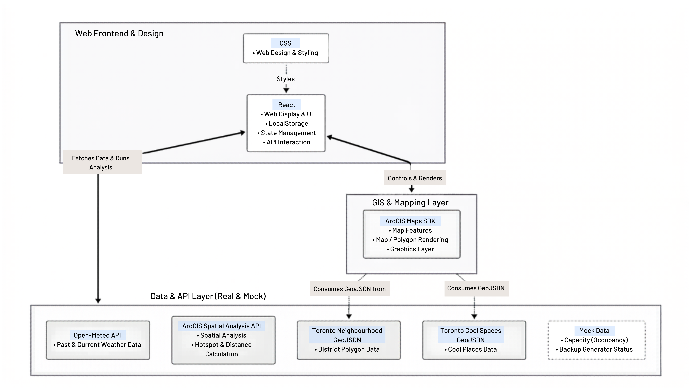

# Climate Response Hub
**A Unified Decision-Support Dashboard for Emergency Management**

---

**Qualifying Video Link:** [Insert YouTube Video Link Here]

**Live Demo:** [Insert Link to your demo drive or hosted app here]

---

## 1. Problem Statement & Unique Value Proposition (UVP)
**Problem:** City emergency coordinators (e.g., Toronto Emergency Management, Toronto Shelter & Support Services) and public health officials often struggle to make rapid decisions during extreme weather events. Massive amounts of fragmented data—including heat vulnerability indexes, live power grid status, and emergency shelter capacity—are siloed across different portals. 

**UVP:** There is a need for a unified, scalable platform that integrates these data sources to provide a single source of truth for proactive disaster management. **Climate Response Hub** solves this by providing a unified command-and-control dashboard that goes beyond static mapping. It uses real-time triage logic to recommend specific, actionable resource deployments (e.g., dispatching mobile cooling units or outreach teams to accessibility blind spots) before an emergency escalates.

---

## 2. Business ROI
- **Economic:** Reduces unnecessary emergency service dispatches by optimizing resource allocation.
- **Operational:** Drastically reduces "tab-switching" cognitive load for coordinators by centralizing data.
- **Efficiency:** Decreases decision-making time from hours of manual analysis to seconds of actionable insight.
- **Equitable Impact:** Ensures life-saving resources reach the most vulnerable populations based on data-driven prioritization.

---

## 3. Submission Artifacts
As required by the hackathon guidelines, our technical and business design documents are available in the `docs/` folder:
* [System Architecture Diagram](./docs/1_system_architecture_diagram.png)
* [UML & Use Case Diagram (CRUD operations)](./docs/2_uml_usecase_diagram.png)
* [Database Schema](./docs/3_database_schema.png)
* [Feasibility Analysis (Business Case) & MVP Roadmap](./docs/4_feasibility_analysis_mvp.pdf)

---

## 4. Data Sources
This prototype leverages the Esri ecosystem alongside mock data to demonstrate functionality and decision-making logic:
* **Public & Real Data:** Esri ArcGIS Living Atlas (Climate vulnerability and demographic layers), City of Toronto's Heat Relief Network (locations of 500+ Cool Spaces).
* **Mock Data:** Real-time infrastructure status (e.g., live occupancy of shelters, backup power availability) and dynamic localized priority scores are hardcoded to simulate real-time API integrations during this prototype phase.

---

## 5. Key Features
- **Dynamic Vulnerability Mapping:** Multi-layer overlays combining heat risk, population density, and flood zones.
- **Resilience-First Filtering:** Real-time visibility into shelter operational status, including backup power and live occupancy.
- **Automated Actionable Insights:** AI-driven triage logic that generates specific "Next Best Actions" for coordinators.
- **Single-Pane-of-Glass Dashboard:** Unified interface merging climate and urban data for immediate situational awareness.
- **ArcGIS Ecosystem Integration:** Leveraging professional-grade spatial analysis for urban planning.

---

## 6. Tech Stack & Architecture Details
Our platform is designed as a lightweight, fast, and highly interactive frontend-heavy MVP, utilizing real APIs and spatial data combined with mock infrastructure data.

*   **React:** Acts as the core logic engine. Handles web display, state management, API interactions, and uses `localStorage` to simulate the 'Log & Track' collaboration database for this prototype.
*   **CSS:** Responsible for responsive web design, ensuring a clean and accessible user interface for emergency coordinators.
*   **ArcGIS Maps SDK:** The geospatial engine responsible for rendering map features, displaying district polygons, and managing interactive graphics layers.
*   **ArcGIS Spatial Analysis API:** Provides advanced spatial computing via API, calculating accurate distances to the nearest cooling centers and actively identifying high-risk hotspots rather than just displaying static data.
*   **Open-Meteo API:** Provides reliable past and real-time current weather/climate data to trigger heatwave alerts.
*   **Toronto Neighbourhood GeoJSON:** Supplies the district polygon data to draw neighborhood boundaries on the map.
*   **Toronto Cool Spaces GeoJSON:** Provides the accurate location data of the City's Heat Relief Network (cool places).
*   **Mock Data:** Hardcoded JSON logic simulating real-time infrastructure metrics, specifically cooling center *Capacity* and *Backup Generator Status*, demonstrating the platform's ability to integrate with future utility partners (e.g., Alectra).

### Architecture Diagram (Conceptual)

